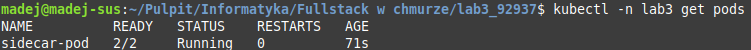
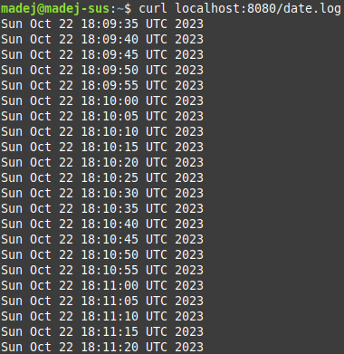

# Laboratorium 3
## Programowanie Full-Stack w Chmurze Obliczeniowej
## Kacper Madejczyk, 92937

### Instrukcja (polecenia do wykonania w konsoli)
Uruchomienie lokalnego klastra minikube, utworzenie przestrzeni nazw `lab3`, utworzenie poda z wymaganymi kontenerami na podstawie specyfikacji z pliku `sidecar-pod.yaml`, sprawdzenie statusu utworzonego poda:

```
minikube start
kubectl create namespace lab3
kubectl create -f sidecar-pod.yaml
kubectl -n lab3 get pods
```



Następnie aby sprawdzić czy logi faktycznie są poprawnie zapisywane i udostępniane przez serwer nginx, należy wykonać następujące komendy:

```
kubectl port-forward -n lab3 sidecar-pod 8080:80 &
curl localhost:8080/date.log
```

Example logs that have been saved:


